# 🚀 Backend Web Development Experiments

> Academic backend experiments built using Node.js, Express.js, MongoDB, and Mongoose.

---

# 📌 Output of Experiment 2.1.1 – Product CRUD (Mongoose)

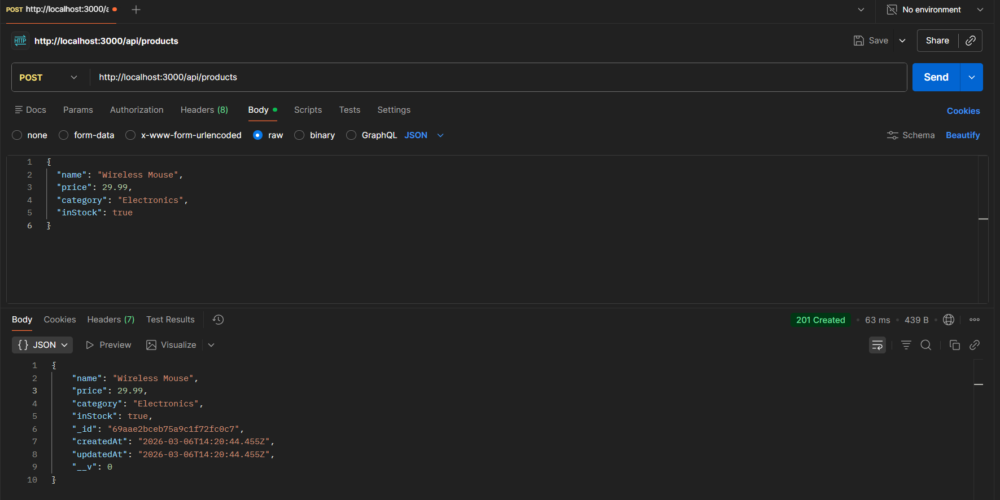

---

# 📌 Output of Experiment 2.1.2 – Student Management System (MVC)

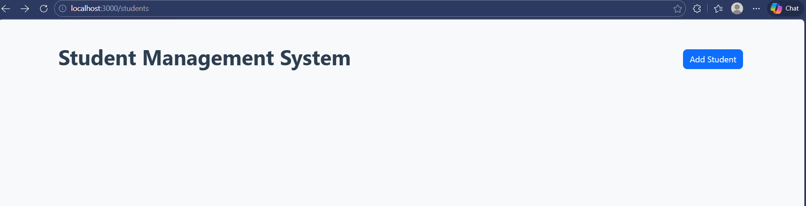

---

# 📌 Output of Experiment 2.1.3 – E-commerce Catalog

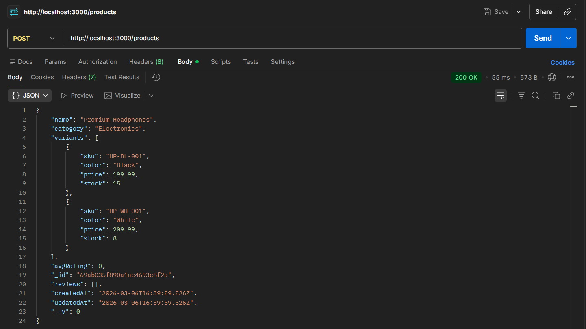

---

# 🔎 Detailed Screenshots

---

## 🔹 Experiment 2.1.1 – Product CRUD

### ➤ Create Product

### ➤ Get All Products
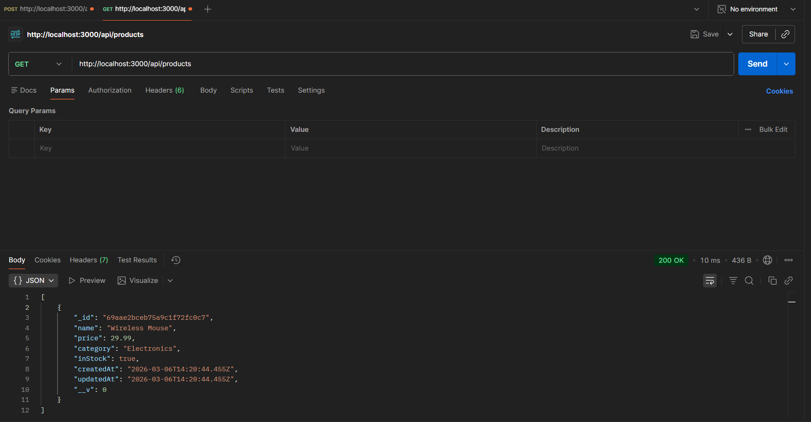

### ➤ Get Single Product
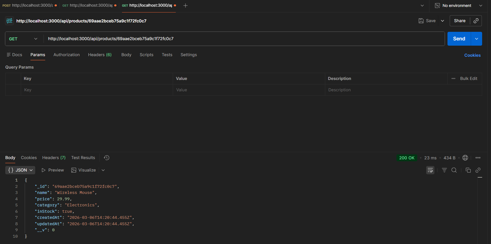

### ➤ Update Product
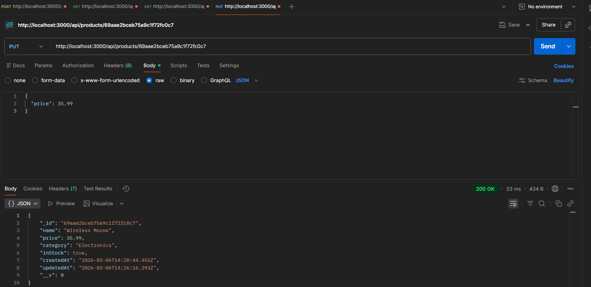

### ➤ Delete Product
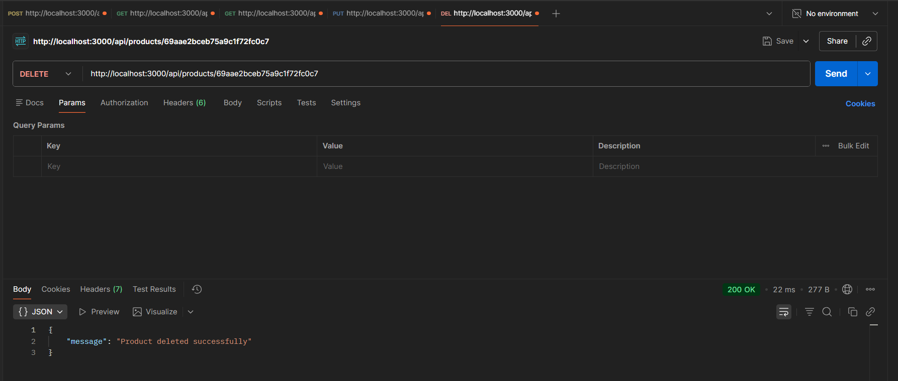

---

## 🔹 Experiment 2.1.2 – Student Management System (MVC)

### ➤ Student List Page

### ➤ Add Student Form
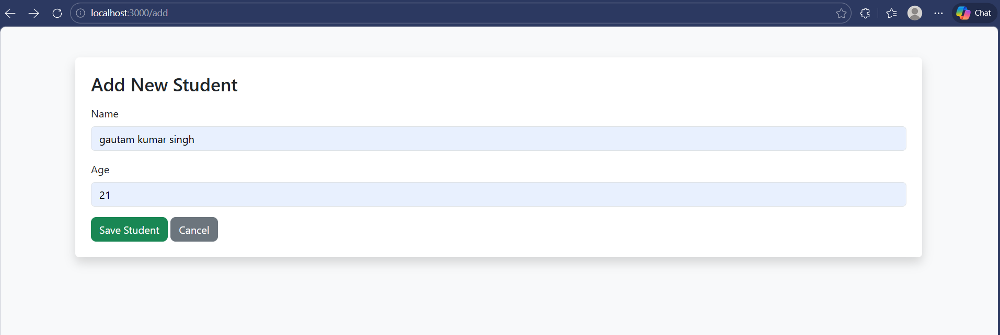

### ➤ List with Data
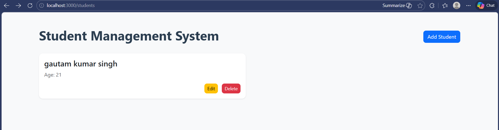

### ➤ Edit Student
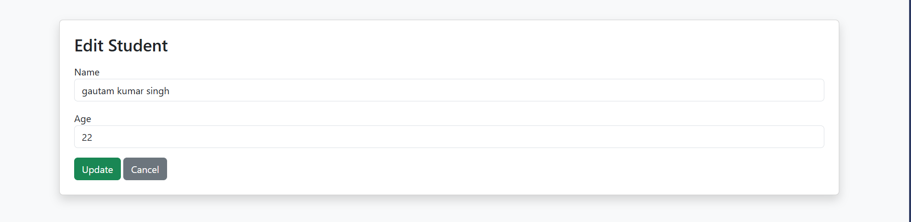

### ➤ Updated Record
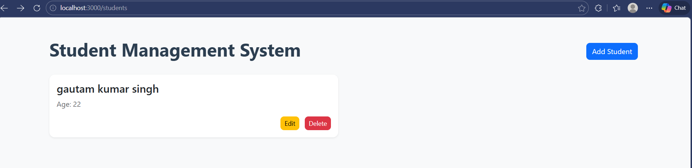

### ➤ Multiple Students View
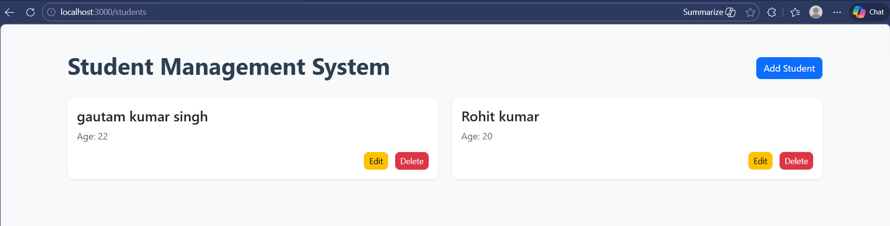

---

## 🔹 Experiment 2.1.3 – E-commerce Catalog (Advanced MongoDB)

### ➤ Create Product with Nested Variants

### ➤ Add Review & Calculate Average Rating
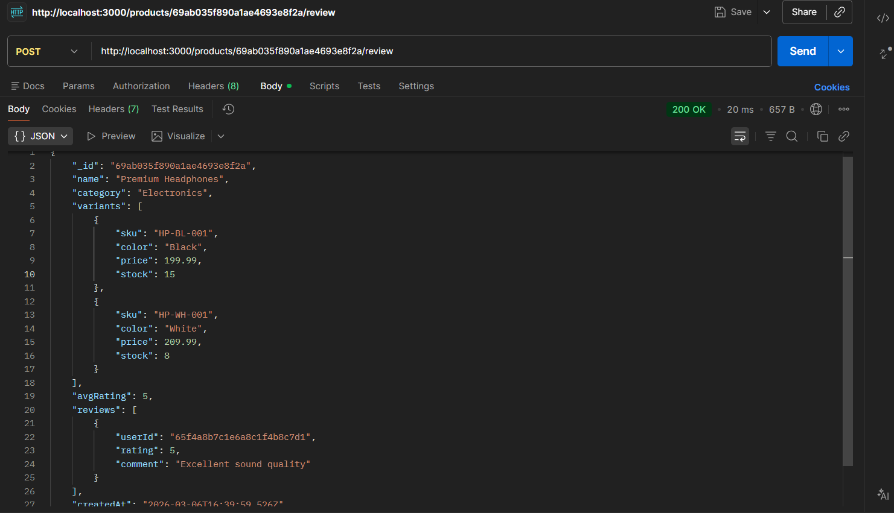

### ➤ Update Variant Stock
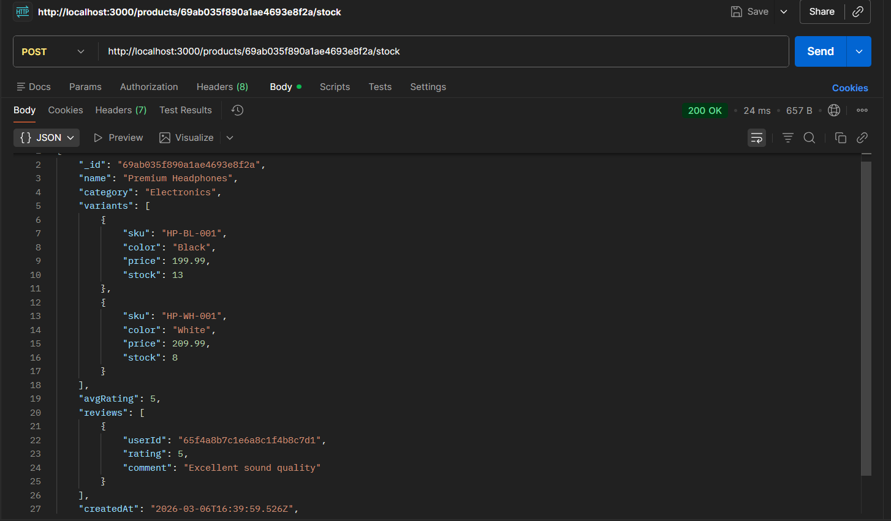

### ➤ Aggregation Statistics
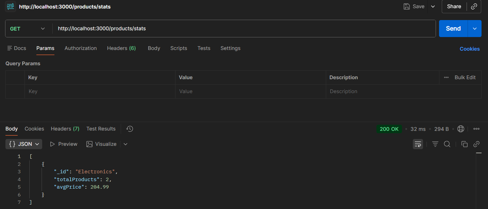

---

# 🛠 Technologies Used

- Node.js  
- Express.js  
- MongoDB  
- Mongoose  
- EJS  
- Postman  

---

# 🎯 Learning Outcomes

- RESTful API development  
- MVC architecture implementation  
- Nested schema modeling  
- Aggregation pipeline usage  
- Index optimization  
- Stock management logic  

---

# 👨‍💻 Author

**Gautam Singh**  
Cyber Security Enthusiast 🚀
